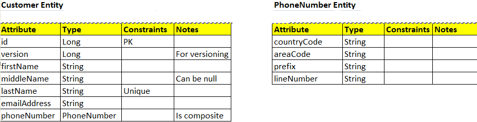

# Spring Boot CRUD Application
To create a simple Spring Boot CRUD (Create, Read, Update, Delete) application involves several steps:
* Create Spring Boot project using **Spring Initializer** (https://start.spring.io/)
* Add dependencies
  - Spring Web (for RESTful APIs)
  - Spring Data JPA (for ORM and database interaction)
  - H2 Database (for an embedded database)
  - MySQL Database (as an external database)
  - Spring Boot DevTools (for live reloading during development)
  - Lombok (to avoid boilerplate code)
  - Spring Validation (for bean validation)
  - Jackson-databind library (to handle the automatic conversion between Java objects to and from JSON)
  - MapStruct library (to reduce the amount of manual mapping code in your application)
  - Spring Actuator (provides essential endpoints to expose application metrics, health, and management data)
  - Prometheus (collect, store, and analyze these metrics, enabling proactive monitoring and alerting)
* Define Entity model
  - **Customer** entity that has an embedded **Phonenumber** entity
    <p align="center">
      
    </p>
* Create a Repository interface - **CustomerRepository** class extends JPARepository that will automatically implement basic CURD operations
* Create a Service class - **CustomerService** class that acts as a bridge between Controller and Repository class. It contains all the business logic
* Create a Controller class - **CustomerController** class it is responsible for handling incoming HTTP requests, processing them, and returning appropriate responses.
* Configure **application.yaml** file in a Spring Boot application for profiling, database connection settings, a connection pool, security configuration, Prometheus integration and Actuator
* Compile the application
  ```mvn
  mvn clean install
  ```
* Run the application
  ```mvn
  mvn spring-boot:run
  ```
* Once your application is up and running, you can access the following endpoints:
  - **GET /api/customers**: Retrieve all Customers
  - **GET /api/customers/{id}**: Retrieve an Customer by ID
  - **POST /api/customers**: Create a new Customer
  - **PUT /api/customers/{id}**: Update an existing Customer
  - **DELETE /api/customers/{id}**: Delete an Customer

# Feature that are implemented in this application
* Implemented **Versioning** concept to track changes made to Customer entity
* Used **@embedded** and **@embeddable** concept to make PhoneNumber as composite dataType
* Used **Mapper** - CustomerMapper interface for converting between different object types (CustomerRequest to Customer and Customer to CustomerResponse class)
* Used **RequestFilter** class to get PATH, ENV data and **RequestLoggingFilter** class to get PODNAME.
* Used **Spring Security** framework to implement HTTP Basic Authentication for all the CRUD Rest APIs
* Implemented **Slf4j logging** framework
* Implemented **GlobalExceptionHandling** concept using **@RestControllerAdvice**
* Taken care of proper response structure for success and error scenarios
* Used **Profiling** concept to separate configurations for different environments
* Implemented **Validation** using **@valid** annotation to validate the request body while creating or updating a customer
* Configured **Spring Boot Actuator** to gather insights into application's health, performance and overall metrics data
* Configured **Prometheus** for collecting, storing, and querying metrics from various services
* Visualizing metrics that Prometheus collect from Spring Boot application using **Grafana**

# This application has 4 environments - DEV, TEST, UAT3, PROD
- **Dev environment** is selected by default, when application is run **Locally**. This is for developing
- **TEST environment** is for Testing the application - Unit Testing and Integration Testing
- **UAT3 environment** is used when application is used as **Dockerized Application**
- **PROD environment** is used when application is used in **Minikube - Running in Kubernetes**
  
### Important things to note
* **H2 database** for **Testing the framework**
* **MYSQL** used for **DEV, UAT3 and PROD environment**
* **Prometheus and Grafana** is only setup in UAT3 envrionment
* 
